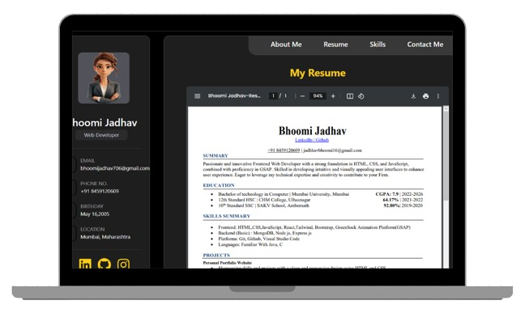

# personal Portfolio

This repository contains the code for my personal portfolio, built to showcase my skills, projects, and experience as a full-stack developer. The portfolio is created using **React** with a focus on responsive design, smooth navigation, and a clean, professional layout.

## Project Overview




This portfolio includes the following sections:

- **Home**: An introduction to myself and my professional background.
- **About Me**: A brief overview of my journey, education, and interests.
- **Resume**: A downloadable PDF of my resume.
- **Skills**: Highlights my technical and non-technical skills.
- **Contact Me**: A form for connecting with me directly.

## Technologies Used

- **Frontend**: React, CSS Modules, Tailwind
- **Backend**: Mern

## Features

- **Smooth Navigation**: User-friendly navigation with a fixed navbar for easy access to all sections.
- **Responsive Design**: The portfolio is fully responsive and looks great on devices of all sizes.
- **Interactive Animations**: Subtle animations using GSAP to enhance user engagement.
- **Downloadable Resume**: Allows users to download my resume directly from the site.
- **Contact Form**: A working contact form that sends messages directly to my email.

## Getting Started

To get a local copy up and running, follow these steps:

### Prerequisites

Make sure you have **Node.js** and **npm** installed on your system.

### Installation

1. Clone the repository:

   ```bash
   git clone https://github.com/BhoomiJadhav/Portfolio.git
   ```

2. Navigate to the project directory:

   ```bash
   cd portfolio
   ```

3. Install dependencies:

   ```bash
   npm install
   ```

### Running the Portfolio

To start the development server, run:

```bash
npm start
```

This will start the project at `http://localhost:5173`.

### Building for Production

To create a production-ready build, use:

```bash
npm run build
```
